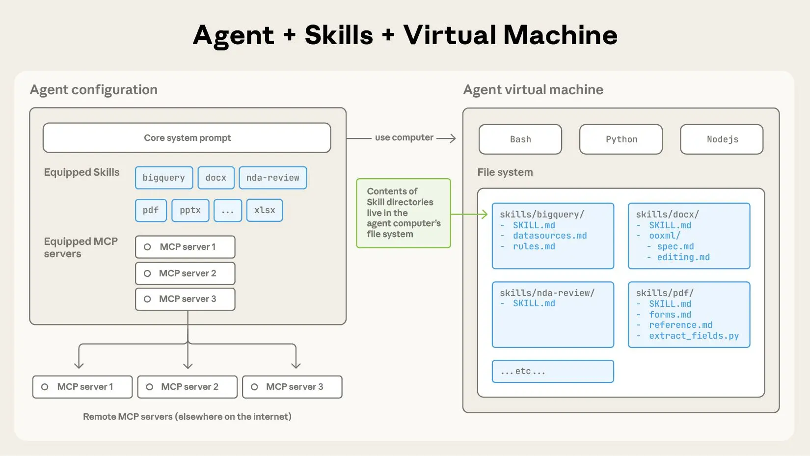

## 写在前面

我个人的看法认为，Agent Skills 是一种工程化的上下文管理手段，目的是减少无关上下文的污染。之前的 system tools 甚至占据了 10% 的上下文，而最近 Claude Code 团队一直在优化初始工具占据的上下文。这次 Skills 的推出，通过 **渐进式信息披露（Progressive Disclosure）** 机制，让我们能够在理论上实现无限的上下文扩展。

## 什么是 Agent Skills？

根据 Anthropic 官方定义：**Agent Skills 是扩展 Claude 功能的模块化能力包**。每个 Skill 打包了指令（instructions）、元数据（metadata）和可选资源（脚本、模板等），Claude 会在任务相关时自动使用它们。



与传统 Prompt Engineering 的关键区别：
- **Skills 是基于文件系统的可重用资源**：一次创建，自动使用
- **Prompts 是对话级的一次性指令**：每次都需要重新提供
- **Skills 支持按需加载**：只在相关时才消耗上下文

## 三层加载机制：Skills 的核心创新

Skills 最巧妙的设计是其**三层内容类型和加载机制**，这是官方文档中特别强调的核心架构：

### 第 1 层：元数据（始终加载）

| 属性 | 说明 |
|------|------|
| **内容类型** | 指令（Instructions） |
| **Token 成本** | 每个 Skill 约 100 tokens |
| **加载时机** | 启动时自动加载到系统提示 |
| **字符限制** | name: 64 字符，description: 1024 字符 |

```yaml
---
name: PDF Processing  # 最多 64 字符
description: Extract text and tables from PDF files, fill forms, merge documents. Use when working with PDF files or when the user mentions PDFs, forms, or document extraction.  # 最多 1024 字符
---
```


这种轻量级方法意味着你可以安装许多 Skills 而不会有上下文惩罚。

### 第 2 层：主指令（触发时加载）

| 属性 | 说明 |
|------|------|
| **内容类型** | 指令（Instructions） |
| **Token 成本** | 通常低于 5k tokens |
| **加载时机** | 用户请求匹配 Skill 描述时 |
| **加载方式** | Claude 通过 bash 读取 SKILL.md |

````markdown
# PDF Processing

## Quick start
Use pdfplumber to extract text from PDFs:
```python
import pdfplumber
with pdfplumber.open("document.pdf") as pdf:
    text = pdf.pages[0].extract_text()
```

For advanced form filling, see [FORMS.md](FORMS.md).
````

### 第 3 层：资源和代码（按需加载）

| 属性 | 说明 |
|------|------|
| **内容类型** | 指令、代码和资源 |
| **Token 成本** | 实际上无限制 |
| **加载时机** | 仅在被引用时 |
| **关键优势** | 脚本执行时只有输出进入上下文 |

```
pdf-skill/
├── SKILL.md          # 主入口（第2层）
├── FORMS.md          # 表单指南（第3层-指令）
├── REFERENCE.md      # API文档（第3层-资源）
└── scripts/
    └── fill_form.py  # 工具脚本（第3层-代码）
```

**这种架构的三个关键优势**（官方文档强调）：

1. **按需文件访问**：Claude 只读取特定任务所需的文件
2. **高效脚本执行**：运行 `validate_form.py` 时，脚本代码永远不会进入上下文窗口，只有输出消耗 tokens
3. **无实际内容限制**：未访问的文件不消耗上下文，Skills 可包含海量参考资料


## Agent设计哲学的演进
1. 第一代：Tools（2023）

- 问题：如何让 AI 执行操作？
- 解决：提供函数调用能力
- 局限：上下文占用大，功能分散

2. 第二代：Skills（2025）

- 问题：如何管理复杂的领域知识？
- 解决：文件系统 + 渐进式加载
- 创新：理论上无限的上下文扩展

3. 并行发展：MCP（2024）

- 问题：如何连接外部世界？
- 解决：标准化协议 + 服务器架构
- 突破：打通 AI 与外部系统的壁垒

个人见解：三者的协同，这三种机制并非相互替代，而是分层协作：

1. MCP 提供数据管道（从外部获取数据）
2. Skills 提供处理逻辑（如何处理数据）
3. Tools 提供执行能力（具体操作实施）

## 重要限制和约束

理解这些限制对于有效规划 Skills 部署至关重要：

### 1. 跨平台不同步

**自定义 Skills 不会跨平台同步**：
- Claude.ai 上传的 Skills 必须单独上传到 API
- API 上传的 Skills 在 Claude.ai 上不可用
- Claude Code Skills 是基于文件系统的，与其他平台隔离

### 2. 运行时环境约束

Skills 在代码执行容器中运行，有以下限制：
- **无网络访问**：Skills 无法进行外部 API 调用或访问互联网
- **不能运行时安装包**：只能使用预安装的包
- **仅限预配置依赖**：需要提前检查可用包列表

### 3. YAML Frontmatter 限制

```yaml
---
name: Your Skill Name  # 最多 64 字符
description: Brief description...  # 最多 1024 字符
---
```
注意：这是**仅有的两个支持的字段**。


## Skills 架构的工作原理

根据官方文档，Skills 运行在代码执行环境中，Claude 具有文件系统访问、bash 命令和代码执行能力。可以这样理解：

**Skills 就像虚拟机上的目录**，Claude 使用 bash 命令与它们交互，就像你在计算机上导航文件一样。

### 实际工作流示例

1. **启动**：系统提示包含 `PDF Processing - Extract text and tables...`
2. **用户请求**："从这个 PDF 中提取文本并总结"
3. **Claude 调用**：`bash: read pdf-skill/SKILL.md` → 指令加载到上下文
4. **Claude 判断**：不需要表单填充，所以不读取 FORMS.md
5. **Claude 执行**：使用 SKILL.md 中的指令完成任务

这种动态加载确保只有相关的 Skill 内容占用上下文窗口。

## 开发 Skills 的黄金法则

1. **描述要精准**：description 应明确说明**何时使用**此 Skill
2. **主文档要简洁**：SKILL.md 控制在 5k tokens 以内
3. **利用第三层**：将详细内容放在额外文件中
4. **代码优于指令**：确定性操作使用脚本而非指令
5. **安全第一**：永远审查外部依赖和文件访问

## Skills 的实际部署：多平台支持详解

根据最新官方文档，Skills 在不同平台的支持情况各有特点：

### 平台支持对比表

| 平台 | 预置 Skills | 自定义 Skills | 共享范围 | 关键特点 |
|------|------------|--------------|---------|----------|
| **Claude API** | ✓ | ✓ | 工作空间级 | 需要 3 个 beta headers |
| **Claude.ai** | ✓ | ✓ | 个人级 | Pro/Team/Enterprise 可用 |
| **Claude Code** | × | ✓ | 项目级 | 基于文件系统，无需上传 |

### API 使用示例（需要 Beta Headers）

```python
import anthropic

# 必需的三个 beta headers
client = anthropic.Anthropic(
    default_headers={
        "anthropic-beta": "code-execution-2025-08-25,skills-2025-10-02,files-api-2025-04-14"
    }
)

# 使用预置的 PowerPoint Skill
response = client.messages.create(
    model="claude-3-5-sonnet-20241022",
    max_tokens=1024,
    messages=[
        {"role": "user", "content": "创建一份关于 AI 搜索技术的 PPT"}
    ],
    container={
        "skill_id": "pptx",  # 预置 Skill ID
        "type": "code_execution_container"
    }
)
```

### 预置 Skills 列表

- **PowerPoint (pptx)**：创建演示文稿、编辑幻灯片、分析内容
- **Excel (xlsx)**：创建电子表格、数据分析、生成带图表的报告
- **Word (docx)**：创建文档、编辑内容、格式化文本
- **PDF (pdf)**：生成格式化的 PDF 文档和报告


## 结语：Skills 的影响

Claude Agent Skills 代表了 AI 智能体发展的重要范式转变——**从单一大模型到可组合能力系统**。通过文件系统和渐进式信息披露，Skills 解决了上下文限制这一核心瓶颈。


## 推荐资源

- [Anthropic 官方 Skills 文档](https://docs.anthropic.com/en/docs/agents-and-tools/agent-skills/overview)
- [Skills Cookbook（示例代码）](https://github.com/anthropics/claude-cookbooks/tree/main/skills)
- [Claude Skill Example](https://github.com/anthropics/skills)

