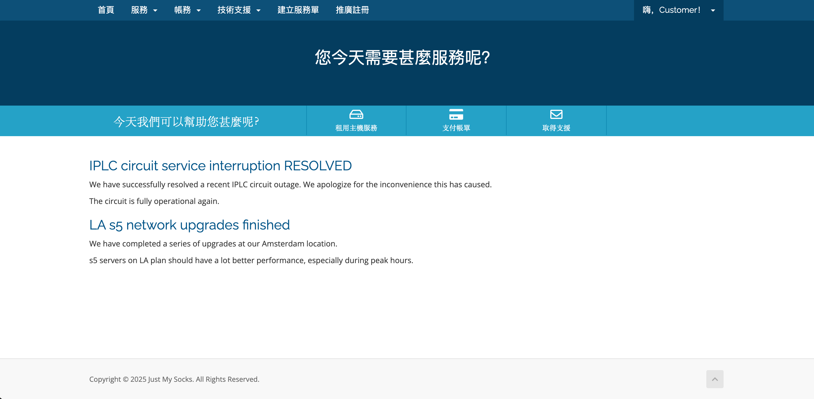

# Just My Socks 使用介绍

[Just My Socks](https://justmysocks.net/members/aff.php?aff=35111) 是由 **搬瓦工（BandwagonHost）官方出品** 的翻墙代理服务，提供稳定的 **Shadowsocks / V2Ray / Trojan** 节点，适用于全球用户，尤其在中国大陆地区拥有良好的可用性和速度。

## 为什么选择 Just My Socks？

- **官方出品，安全可靠**：由搬瓦工团队直接维护，非第三方代理；
- **多节点智能切换**：自动选择最优线路（包括洛杉矶、东京、伦敦等）；
- **支持多种协议**：SS / SSR / V2Ray / Trojan 多协议兼容；
- **高速稳定**：专线加速，Netflix、YouTube、ChatGPT 流畅访问；
- **价格透明，支持退款**：按月/年订阅，无隐藏费用；
- **支付宝 / PayPal 支付**：支持多种国际支付方式。

## 使用步骤

1. 访问 [Just My Socks 官网](https://justmysocks.net/members/aff.php?aff=35111)；

2. 选择合适的套餐（推荐 **Just My Socks LA 5**）；
3. 注册账户并完成支付；
4. 根据页面提供的配置信息，导入到你的 Shadowsocks / Clash / V2Ray 客户端

## 常见问题

**Q：是否支持多设备？**  
A：支持，每个账户可同时在多台设备上使用，具体数量依套餐而定。

**Q：购买后多久能使用？**  
A：支付完成后系统会自动开通，几乎可以立即使用。

**Q：可以退款吗？**  
A：官方提供 5 天无理由退款保障（限未超流量使用）。

---
