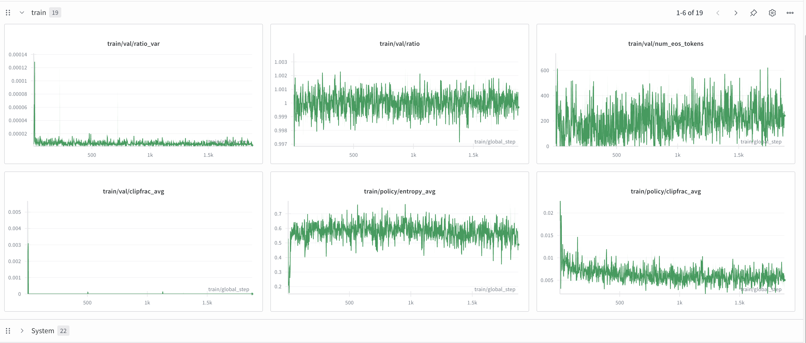
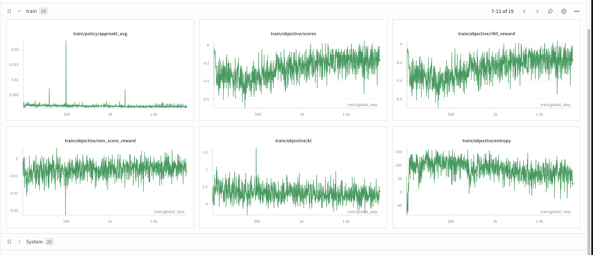
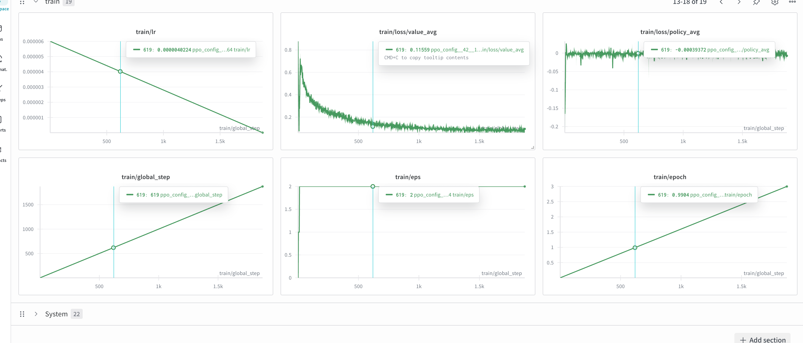
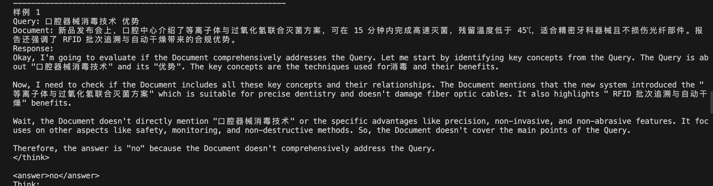
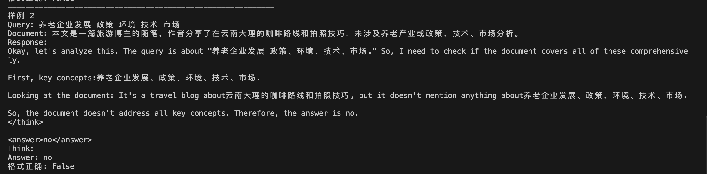
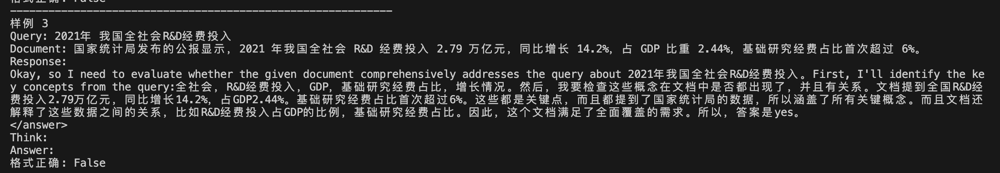
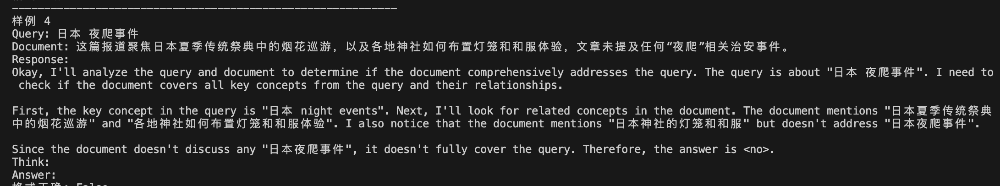

# Rerank R0

## 初始模型

初始模型是 `deepseek-ai/DeepSeek-R1-Distill-Qwen-1.5B`。

## 项目概览

这是一个文档重排序项目，结合了 ProRank 与 Rank-R1 两篇论文的思路，使用强化学习（PPO）训练一个能够先思考再排序的模型。

## 项目目标

- 训练一个会“先思考再排序”的文档重排序模型
- 优化推理型基础模型（如 DeepSeek-R1 及其蒸馏版本）的排序表现
- 当前使用的基础模型：`deepseek-ai/DeepSeek-R1-Distill-Qwen-1.5B`

## 项目基石

现有 Rerank 模型的主流做法是在 LLM 输出层加一个二分类头（softmax over "yes"/"no"）。我们假设推理模型的思考能力优于基础模型，在语义理解层面有潜在优势，因此通过引导模型“先思考后回答”提升排序质量。

## 项目结构

```bash
rerank-r0/
├── prorank/                # 核心代码模块
│   ├── config.py           # 配置加载
│   ├── data.py             # 数据处理
│   ├── models.py           # 模型定义
│   ├── reward.py           # 奖励函数
│   ├── trainer.py          # PPO 训练主程序
│   ├── sft_stage_a.py      # SFT 监督微调训练
│   └── utils.py            # 工具函数
├── scripts/
│   └── convert_data.py     # 数据格式转换脚本
├── configs/
│   └── stage_a.yaml        # 阶段 A 训练配置
├── deepspeed_zero2.json    # DeepSpeed 配置
├── pyproject.toml          # 项目依赖配置
└── project.md              # 项目方案文档
```

## 主要组件

- 阶段 A 训练：通过 PPO 强化学习让模型掌握规范输出与二分类判断
- 数据转换：将原始日志数据转换为训练所需格式
- 规则奖励：结合格式、准确性与长度控制形成奖励信号

## 快速开始

### 1. 数据准备

从日志中抽取数据，并使用千寻中的 DS R1 模型运行指定 Prompt：

```bash
Evaluate if the Document comprehensively addresses the Query. All key concepts in the Query must be present and properly connected in the Document. The Document should provide information about the relationship between all query terms, not just mention them in isolation. Answer "yes" only if the Document satisfies the complete information need. Output exactly "yes" or "no".
```

如果需要转换原始数据，执行：

```python
python scripts/convert_data.py <input_jsonl> <output_jsonl> --max-think-chars 1200000
```

### 2. 数据格式要求

**输入 JSONL**

```json
{
  "query": "（用户问题 / 检索请求）",
  "response": "（模型判定为最优的文档或摘要片段）",
  "response_thinking": "（解释为什么 response 能很好地覆盖 query 的分析推理）",
  "rejected_response": [
    {
      "document": "（被否决的候选文档 1）",
      "thinking": "（否决理由 / 为什么该文档不如 response）"
    },
    {
      "document": "（被否决的候选文档 2）",
      "thinking": "（否决理由 / 为什么该文档不如 response）"
    }
  ]
}
```

**输出 JSONL**

```json
{
  "query": "（用户问题 / 检索请求）",
  "document": "（模型判定为最优的文档或摘要片段）",
  "think": "（解释为什么 response 能很好地覆盖 query 的分析推理）",
  "answer": "yes",
  "label": 1
}
```

### 3. 启动训练

启动阶段 A 的 PPO 训练：

```python
python prorank/trainer.py --config configs/stage_a.yaml
```

训练目标：

- 严格遵守 `<think>`/`<answer>` 输出格式
- 提升文档相关性判断准确率
- 控制思考长度，避免过度输出

## 配置文件详解

`configs/stage_a.yaml` 中的关键配置如下：

```yaml
# Training
epochs: 1
batch_size: 2
learning_rate: 6e-6
kl_coef: 0.02
seed: 42

# Generation
max_new_tokens: 256
temperature: 0.7
top_p: 1.0
max_think_tokens: 200
gradient_checkpointing: true
missing_eos_penalty: 0.5

# Prompts
system_prompt: |
  [system]
  You are a document relevance evaluator. Your task is to determine if a Document comprehensively addresses a given Query.

  Evaluation Criteria:
  - ALL key concepts from the Query must be present in the Document
  - The Document must explain relationships and connections between query terms
  - Isolated mentions without context are insufficient
  - The Document should satisfy the complete information need expressed in the Query

  Process:
  1. First, analyze in <think> tags (max 128 tokens): identify key concepts in the Query, check their presence and interconnection in the Document
  2. Then output your final judgment in <answer> tags: exactly "yes" for comprehensive coverage or "no" for insufficient coverage
  3. Do not output any other characters or explanations outside these tags

  Only answer "yes" if the Document fully satisfies the Query's information requirements.

# Reward config
reward:
  format_weight: 0.4
  acc_weight: 0.5
  length_penalty: 0.05
  max_think_tokens: 200
  extra_text_penalty: 0.2
  invalid_tag_penalty: 0.5
  missing_answer_penalty: 0.3
  think_bonus: 0.3
  min_think_tokens: 64

# PPO extras - Fixed parameter names
ppo:
  num_ppo_epochs: 2
  cliprange: 0.2
  cliprange_value: 0.2
  vf_coef: 0.2
  gamma: 0.99
  lam: 0.95
  whiten_rewards: false
```

## 训练流程

阶段 A：Prompt 与二分类 Warmup。

1. 模型加载：加载基础模型与 tokenizer
2. 数据处理：构建 PPO 训练数据集
3. 奖励设计：组合格式、准确性、长度控制等规则奖励
4. PPO 训练：通过强化学习优化策略
5. 模型保存：输出训练好的模型与 tokenizer

## 奖励函数机制

项目使用规则奖励模型评估输出：实现一个伪神经网络（继承 `nn.Module`），通过缓存 `input_ids` 与规则计算 reward 来适配 TRL 接口。相比训练昂贵的神经网络奖励模型，此方案更轻量；对于纯规则奖励的场景，后续可考虑切换 GRPO 以获得更高效率。

```bash
TRL Trainer
    │
    ├─> 调用 model.backbone(input_ids)
    │       │
    │       └─> _DummyBackbone.forward()
    │               ├─ 缓存 input_ids 到 self._cached_input_ids
    │               └─ 返回假的 hidden_states（全零张量）
    │
    └─> 调用 model.score(hidden_states)
            │
            └─> RuleRewardModel.score()
                    ├─ 忽略 hidden_states
                    ├─ 从缓存中读取 input_ids
                    ├─ 对每个样本：
                    │     ├─ 匹配 token 前缀找到标签
                    │     ├─ 解码生成部分为文本
                    │     └─ 用规则计算奖励
                    └─ 返回 [B, L, 1] 奖励张量
```

### 奖励项拆解

- `format_weight (0.4)`: 输出 `<answer>yes/no</answer>` 时奖励 `+0.4`
- `acc_weight (0.5)`: 分类正确奖励 `+0.5`
- `think_bonus (0.3)`: 思考 token 数在 `[64, 200]` 内奖励 `+0.3`
- `length_penalty (0.05)`: 超出 `max_think_tokens` 时按比例扣分
- `extra_text_penalty (0.2)`: `</answer>` 之后存在额外文本时扣分
- `invalid_tag_penalty (0.5)`: 缺失 `<think>` 或 `<answer>` 标签时扣分
- `missing_answer_penalty (0.3)`: 缺少 `<answer>` 时直接施加额外负分，总扣分最高至 `-0.8`
- `min_think_tokens` / `max_think_tokens`: 约束思考长度以触发奖励或惩罚

示例：

- 正确：`<think>...</think><answer>yes</answer>`
- 错误：`<think>...</think><answer>yes</answer> This is extra text!`

## 训练记录







## 模型推理格式

训练后的模型输出示例：

```
<think>
这里是模型的推理过程，分析 query 和 document 的相关性...
</think>
<answer>yes</answer>
```









## 后续阶段规划

- 阶段 A（当前）：Prompt 与二分类 Warmup
- 阶段 B：Listwise 推理排序强化
- 阶段 C：细粒度监督得分学习

## 迁移到 MobileLLM-R1-950M

📋 **概述**：新模型参数更小、推理更快，同时保持良好表现。

| 特性 | DeepSeek-R1 1.5B | MobileLLM-R1 950M |
| --- | --- | --- |
| 参数量 | 1.5B | 950M ⚡ |
| 推理能力 | 蒸馏模型 | 原生推理训练 🎯 |
| 训练数据 | 通用 | 大量推理数据集 📚 |
| 显存占用 | ~6GB | ~4GB ⚡ |
| 训练速度 | 基准 | ~1.5x 更快 ⚡ |
| 许可证 | Apache 2.0 | FAIR NC（仅非商业）⚠️ |

### 注意事项

- 许可证限制：仅限非商业研究使用
- 若需商业部署，请继续使用 DeepSeek-R1
